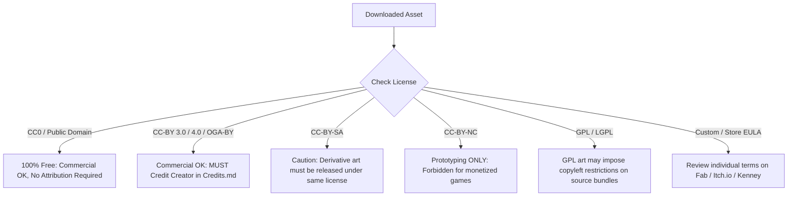

# 🎮 Game Development Free Assets Master Directory & Guide

> **Target Project:** SJCET-Game (`/home/meoclavezz/Projects/SJCET-Game`)  
> **Compiled From:** [Kenney.nl](https://kenney.nl/assets), [OpenGameArt.org](https://opengameart.org/), [itch.io Free Assets](https://itch.io/game-assets/free), and the [r/gamedev Ultimate 50+ Asset List](https://www.reddit.com/r/gamedev/comments/1m76pm4/the_ultimate_free_game_dev_asset_list_50_sites/).  
> **Last Verified:** September 2026

---

## 📑 Table of Contents
1. [Core Mega-Hubs & Foundational Portals](#1-core-mega-hubs--foundational-portals)
2. [Licensing & Legal Quick-Check Guide](#2-licensing--legal-quick-check-guide)
3. [Multi-Category Suites & Full-Game Bundles](#3-multi-category-suites--full-game-bundles)
4. [3D Models, Environments, Rigging & Materials](#4-3d-models-environments-rigging--materials)
5. [2D Sprites, Pixel Art, Characters & Tilesets](#5-2d-sprites-pixel-art-characters--tilesets)
6. [Top Indie Asset Creators & Standout Packs (Itch.io)](#6-top-indie-asset-creators--standout-packs-itchio)
7. [Soundtracks & Game Music](#7-soundtracks--game-music)
8. [Sound Effects (SFX), Foley & Audio Generators](#8-sound-effects-sfx-foley--audio-generators)
9. [UI, HUD, Icons & Typography](#9-ui-hud-icons--typography)
10. [Engine Pipeline & Recommended Directory Structure](#10-engine-pipeline--recommended-directory-structure)
11. [Attribution & Credits Template](#11-attribution--credits-template)

---

## 1. Core Mega-Hubs & Foundational Portals

These four platforms are the primary hubs specified for asset sourcing. Combined, they contain virtually every type of asset needed to prototype, develop, and publish a game:

| Hub | Best For | Typical License | Direct Link |
| :--- | :--- | :--- | :--- |
| **Kenney ("Asset Jesus")** | 20,000+ modular 2D, 3D, UI, and audio assets with cohesive art styles. Ideal for fast prototyping and clean stylized games. | **CC0 1.0 (Public Domain)** - 100% free, commercial use allowed, no attribution required. | [kenney.nl/assets](https://kenney.nl/assets) |
| **OpenGameArt (OGA)** | The longest-standing open community database for sprites, 3D meshes, textures, music loops, and sound effects. | **Mixed Open Licenses** (CC0, CC-BY 3.0/4.0, CC-BY-SA, OGA-BY, GPL v2/v3). Always check individual posts. | [opengameart.org](https://opengameart.org/) |
| **Itch.io Free Assets** | Vibrant indie marketplace with exceptional high-detail pixel art, hand-crafted 3D low-poly packs, and modular animation sets. | **Creator Specific** (Mostly CC0, CC-BY, or custom free game-dev permissive licenses). | [itch.io/game-assets/free](https://itch.io/game-assets/free) |
| **r/gamedev Curated 50+** | The community-vetted master compilation of 50+ specialized sites covering niche sound archives, procedural generators, and PBR textures. | **Varies by platform** (Detailed breakdown below). | [Reddit Post Discussion](https://www.reddit.com/r/gamedev/comments/1m76pm4/the_ultimate_free_game_dev_asset_list_50_sites/) |

---

## 2. Licensing & Legal Quick-Check Guide

Before integrating any asset into `SJCET-Game`, verify its license tag:



### License Summary Table:
*   **CC0 (Public Domain):** Free for all uses. No attribution required (though polite to mention).
*   **CC-BY (Attribution):** Free for commercial use. You **must** provide credit and link to the source.
*   **CC-BY-SA (ShareAlike):** Free, but if you alter or adapt the asset, your adaptations must use the same license.
*   **CC-BY-NC (Non-Commercial):** Strictly non-monetized. Avoid if you plan commercial distribution on Steam, Play Store, etc.
*   **SIL Open Font License (OFL):** Standard for fonts in games. You can embed the font freely in software, but cannot sell the raw font file standalone.

---

## 3. Multi-Category Suites & Full-Game Bundles

These sites provide complete starter packages spanning art, 3D, audio, and UI in unified aesthetics.

*   **[Kenney](https://kenney.nl/assets)**
    *   *Assets:* 2D platformers, top-down shooters, racing, 3D nature, city, dungeon, space, UI vectors, crosshairs, audio chiptunes, input prompts.
    *   *License:* CC0 (Public Domain).
    *   *Highlights:* `Kenney Game Assets All-in-1`, `UI Pack`, `Input Prompts` (Xbox, PS, Switch, Keyboard glyphs).
*   **[OpenGameArt](https://opengameart.org/)**
    *   *Assets:* 2D sprites, tilesets, 3D models, textures, full orchestral/chiptune soundtracks, foley sound effects.
    *   *License:* CC0, CC-BY, CC-BY-SA, OGA-BY.
    *   *Key Collections:*
        *   [Liberated Pixel Cup (LPC)](https://opengameart.org/content/lpc-collection) — Comprehensive 32x32 top-down RPG spritesheets (walk, attack, cast).
        *   [Glitch Sprite Assets](https://opengameart.org/content/glitch-sprite-assets-huge-collection) — Massive public domain archive of thousands of hand-drawn game assets from the MMO *Glitch*.
*   **[Itch.io Free Game Assets](https://itch.io/game-assets/free)**
    *   *Assets:* Thousands of top-down, side-scroller, isometric, and low-poly 3D packs.
    *   *License:* Varies by creator (filter tags: `CC0`, `Creative Commons`).
*   **[DevAssets](https://devassets.com/)**
    *   *Created by:* Brackeys & dev team.
    *   *Assets:* High-quality curated 2D and 3D game packs (City, Nature, Sci-Fi, Western, Kart Racing).
    *   *License:* 100% Royalty-Free for commercial & non-commercial use.
*   **[Quaternius](https://quaternius.com/)**
    *   *Assets:* Over 2,000 modular low-poly 3D models with animations and texture atlases.
    *   *License:* CC0 (Public Domain).
    *   *Highlights:* Modular characters, stylized nature, medieval village, sci-fi modular kit, cyberpunk city, monster packs.
*   **[KayKit by Kay Lousberg](https://kaylousberg.itch.io/)**
    *   *Assets:* Distinctive stylized 3D low-poly kits with matching textures and animations.
    *   *License:* CC0 (Public Domain).
    *   *Packs:* Adventurers, Skeletons, Dungeon Pack, Medieval Hexagon, Forest Nature, Character Animations.
*   **[Kevin's Mom's House](https://kevins-moms-house.itch.io/)**
    *   *Assets:* Authentic retro 8-bit and 16-bit pixel art characters, props, and environments.

---

## 4. 3D Models, Environments, Rigging & Materials

For 3D projects (Godot 3D, Unity, Unreal, Raylib, Bevy):

*   **[Fab (formerly Sketchfab + Unreal Engine Marketplace + Quixel)](https://www.fab.com/)**
    *   *Highlights:* Epic Games' unified ecosystem. Huge selection of free monthly AAA-quality assets, environments, characters, and props.
    *   *Formats:* glTF, FBX, OBJ, Unreal uasset.
*   **[Mixamo by Adobe](https://www.mixamo.com/)**
    *   *Highlights:* **Crucial animation tool.** Upload any 3D humanoid character mesh (.fbx/.obj) to automatically rig skeleton bones and download hundreds of free mocap animations (idle, run, combat, jump, dance, dialogue).
    *   *License:* Free for commercial and non-commercial game development with Adobe ID.
*   **[Poly Haven](https://polyhaven.com/)**
    *   *Assets:* Photorealistic PBR materials (1k-8k), HDRIs (360° skyboxes/lighting), and 3D scanned models.
    *   *License:* CC0 (Public Domain).
*   **[ambientCG](https://ambientcg.com/)**
    *   *Assets:* 2,000+ seamless PBR texture sets (Albedo, Normal, Roughness, Displacement, Ambient Occlusion) and 3D scans.
    *   *License:* CC0 (Public Domain).
*   **[Poly Pizza](https://poly.pizza/)**
    *   *Assets:* Massive search engine archiving thousands of low-poly 3D models from Google Poly and indie creators.
    *   *License:* Mostly CC-BY / CC0.
*   **[FreePoly](https://www.freepoly.org/)**
    *   *Assets:* Free stylized 3D game models, weapons, characters, and foliage.
*   **[FreeStylized](https://freestylized.com/)**
    *   *Assets:* Stylized hand-painted textures, smart materials, and 3D environment props.
*   **[Sketchfab (Downloadable Filter)](https://sketchfab.com/)**
    *   *Assets:* Millions of community 3D scans, stylized characters, and vehicles.
    *   *Filter by:* "Downloadable" + "CC0" or "CC-BY".
*   **[Textures.com](https://www.textures.com/)**
    *   *Assets:* Huge library of photo-based game textures, decals, and 3D scans (free tier includes daily download credits).
*   **[Share Textures](https://www.sharetextures.com/)**
    *   *Assets:* 1,400+ free CC0 PBR textures, architectural materials, and decals.
*   **[Free3D](https://free3d.com/)**
    *   *Assets:* General 3D models (.blend, .fbx, .obj) for architectural, vehicle, and character assets.

---

## 5. 2D Sprites, Pixel Art, Characters & Tilesets

For 2D games (pixel art, top-down RPG, side-scroller, metroidvania):

*   **[Game-Icons.net](https://game-icons.net/)**
    *   *Assets:* **4,000+ clean vector game icons** covering weapons, spells, armor, status effects, skills, UI symbols.
    *   *Formats:* SVG and customizable PNGs with custom background colors, borders, and gradients.
    *   *License:* CC-BY 3.0.
*   **[CraftPix.net Freebies](https://craftpix.net/freebies/)**
    *   *Assets:* High-quality 2D game characters (animated spritesheets), tilesets (desert, forest, dungeon, sci-fi), and GUI kits.
    *   *License:* Free for commercial projects.
*   **[GameArt2D Freebies](https://www.gameart2d.com/freebies.html)**
    *   *Assets:* 2D platformer tilesets, side-scrolling animated characters, and game UI.
*   **[Super Game Asset](https://www.supergameasset.com/free-game-assets)**
    *   *Assets:* Isometric RPG tiles, icons, and character sprites.
*   **[Reiner's Tilesets](https://www.reinerstilesets.de/)**
    *   *Assets:* Classic pre-rendered isometric and top-down 2D sprites, buildings, monsters, animals, and nature assets.
*   **[Lospec](https://lospec.com/)**
    *   *Assets:* The ultimate pixel art community hub. Palettes (Pico-8, GameBoy, ENDESGA 32), tutorials, and pixel art tools.
*   **[Pixabay](https://pixabay.com/) & [Pexels](https://www.pexels.com/) & [Unsplash](https://unsplash.com/)**
    *   *Assets:* Free high-resolution photos, skies, seamless textures, and reference photos for environment design.
*   **[Vecteezy](https://www.vecteezy.com/)**
    *   *Assets:* Vector illustrations, decorative UI elements, banners, and game backgrounds.

---

## 6. Top Indie Asset Creators & Standout Packs (Itch.io)

These creators consistently deliver industry-standard free packs on itch.io:

### 🌟 Pixel Frog
*   **[Tiny Swords](https://pixelfrog-assets.itch.io/tiny-swords)**: Animated knights, archers, goblins, castles, terrain tilesets, and water shaders for top-down action/strategy games.
*   **[Pixel Adventure 1 & 2](https://pixelfrog-assets.itch.io/pixel-adventure-1)**: Classic side-scrolling platformer characters with complete movement animations, traps, fruits, and terrain.

### 🌟 LimeZu
*   **[Modern Interiors (16x16)](https://limezu.itch.io/moderninteriors)**: Unmatched collection of modern furniture, computers, classrooms, living spaces, offices, walls, and flooring. Perfect for school, college, and city settings.

### 🌟 Quaternius
*   **[Universal Animation Library 1 & 2](https://quaternius.com/)**: 100+ standard animations applicable to any humanoid 3D model.
*   **[Universal Base Characters](https://quaternius.com/)**: Low-poly modular men, women, outfits, and accessories.
*   **[Stylized Nature MegaKit](https://quaternius.com/)**: Trees, rocks, grass, flowers, water bodies.
*   **[Medieval Village MegaKit](https://quaternius.com/)**: 300+ models for historic / fantasy towns.

### 🌟 Kay Lousberg (KayKit)
*   **[KayKit - Character Pack : Adventurers](https://kaylousberg.itch.io/kaykit-adventurers)**: Low-poly rigged adventurers (Knight, Rogue, Mage, Barbarian) with weapons and animations.
*   **[KayKit - Dungeon Pack](https://kaylousberg.itch.io/kaykit-dungeon)**: Modular walls, doors, torches, chests, and traps.
*   **[KayKit - Forest Nature Pack](https://kaylousberg.itch.io/kaykit-forest-nature-pack)**: Stylized low-poly trees, stones, logs, and vegetation.

### 🌟 Other Essential Itch.io Free Packs
*   **[Sprout Lands by Cup Nooble](https://cupnooble.itch.io/sprout-lands-asset-pack)**: Whimsical top-down farming, character sprites, and nature.
*   **[Tiny RPG Character Asset Pack by Zerie](https://zerie.itch.io/tiny-rpg-character-asset-pack)**: 16x16 modular characters, hair, weapons, armor.
*   **[Pixel Art Top Down - Basic by Cainos](https://cainos.itch.io/pixel-art-top-down-basic)**: 32x32 sprites, trees, building walls, fences, and props.
*   **[Brackeys' Platformer Bundle](https://brackeysgames.itch.io/brackeys-platformer-bundle)**: Pixel art hero, enemies, terrain, sound effects, and music.
*   **[Ninja Adventure by pixel-boy](https://pixel-boy.itch.io/ninja-adventure-asset-pack)**: Top-down Japanese / ninja aesthetic tilesets, musics, sounds, and characters.
*   **[The Mana Seed Character Base by Seliel the Shaper](https://seliel-the-shaper.itch.io/character-base)**: Comprehensive customizable pixel-art base for RPG characters.
*   **[16x16 DungeonTileset II by 0x72](https://0x72.itch.io/dungeontileset-ii)**: Animated characters, weapons, enemies, and dungeon tiles.
*   **[Sunnyside World by Daniel Diggle](https://danieldiggle.itch.io/sunnyside-world)**: Top-down craft, farm, town exploration tiles.
*   **[8000+ Raven Fantasy Icons by Clockwork Raven](https://clockworkraven.itch.io/8000-raven-fantasy-icons)**: Huge assortment of pixel art RPG icons.

---

## 7. Soundtracks & Game Music

Royalty-free background tracks and loops across all genres:

| Resource | Specialty | License | Link |
| :--- | :--- | :--- | :--- |
| **FreePD** | Curated catalog of orchestral, electronic, ambient, and horror tracks. | **CC0 (Public Domain)** | [freepd.com](https://freepd.com/) |
| **Incompetech** | Kevin MacLeod's legendary library (used in thousands of indie games). | **CC-BY 3.0 / 4.0** | [incompetech.com](https://incompetech.com/) |
| **Tallbeard Studios Music Loops** | 200+ seamless music loops designed specifically for games. | **CC0 (Public Domain)** | [tallbeard.itch.io](https://tallbeard.itch.io/music-loop-bundle) |
| **Free Music Archive (FMA)** | Thousands of independent songs tagged by mood and genre. | Varies (Filter by CC-BY / CC0) | [freemusicarchive.org](https://freemusicarchive.org/) |
| **Open Music Archive** | Recordings of out-of-copyright and historical public domain music. | Public Domain | [openmusicarchive.org](https://www.openmusicarchive.org/) |
| **Bensound** | High quality cinematic, acoustic, and modern background music. | Free with attribution | [bensound.com](https://www.bensound.com/) |
| **PlayOnLoop** | Short, seamless music loops built specifically for UI and game states. | Free with attribution | [playonloop.com](https://www.playonloop.com/) |
| **Musopen** | High-definition classical music recordings (Bach, Beethoven, Mozart). | Public Domain / CC0 | [musopen.org](https://musopen.org/) |
| **Soundimage.org** | Eric Matyas' library of over 4,000 game-ready music tracks and ambiances. | Free with attribution | [soundimage.org](https://soundimage.org/) |
| **IndieGameMusic** | Dedicated indie composer directory with searchable royalty-free tracks. | Varies by composer | [indiegamemusic.com](https://www.indiegamemusic.com/) |
| **Fesliyan Studios** | Dynamic scoring for action, comedy, RPG, and horror games. | Free with attribution | [fesliyanstudios.com](https://www.fesliyanstudios.com/) |
| **Tunetank & Uppbeat** | Modern creator soundtrack libraries with curated game tracks. | Free tiers available | [tunetank.com](https://tunetank.com/) / [uppbeat.io](https://uppbeat.io/) |
| **ccMixter (Dig ccMixter)** | Remix music archive by global musicians. | CC-BY | [dig.ccmixter.org](http://dig.ccmixter.org/) |

---

## 8. Sound Effects (SFX), Foley & Audio Generators

*   **[Sonniss GameAudioGDC Archive](https://sonniss.com/gameaudiogdc/)**
    *   *Description:* **The gold standard for game audio.** Every year for GDC, Sonniss releases 20–50 GB of pro-grade sound effects (weapons, explosions, monster roars, ambient environments, vehicles, foley).
    *   *License:* 100% Royalty-Free for commercial use, no attribution required.
*   **[Freesound.org](https://freesound.org/)**
    *   *Description:* The world's largest collaborative sound effects database (500,000+ clips).
    *   *Search Tip:* Filter queries using `license:"Creative Commons 0"` for zero-attribution foley and sound design.
*   **[Zapsplat](https://www.zapsplat.com/)**
    *   *Description:* 100,000+ professionally recorded sound effects and Foley items.
    *   *License:* Free with attribution (or subscription for no attribution).
*   **[jsfxr (Online 8-Bit SFX Generator)](https://sfxr.me/)**
    *   *Description:* Web-based procedural audio synthesizer. Generate instant retro sound effects for `Pickup/Coin`, `Laser/Shoot`, `Explosion`, `Powerup`, `Hit/Hurt`, `Jump`, and `Blip/Select`.
    *   *Export:* Direct `.wav` download. CC0 / Public domain output.
*   **[99Sounds](https://99sounds.org/)**
    *   *Description:* Cinematic sound design libraries, sci-fi effects, drum kits, and atmospheric soundscapes.
    *   *License:* 100% Royalty-Free commercial use.
*   **[Mixkit SFX](https://mixkit.co/)**
    *   *Description:* Clean UI clicks, game transition sounds, notifications, and alerts.
*   **[SoundBible](https://soundbible.com/free-sound-effects-1.html)**
    *   *Description:* Real-world recordings of nature, animal sounds, machines, and household foley (CC0 & CC-BY).
*   **[BigSoundBank](https://bigsoundbank.com/)**
    *   *Description:* Thousands of field recordings and stereo audio clips under CC0.
*   **[Soundjay](https://www.soundjay.com/) & [FreeSFX](https://freesfx.co.uk/)**
    *   *Description:* General button clicks, beeps, footsteps, and ambient sound effects.

---

## 9. UI, HUD, Icons & Typography

### Game UI & HUD Elements:
*   **[Kenney UI Packs](https://kenney.nl/assets/category/ui)**: Clean vector buttons, panels, sliders, checkboxes, health bars, inventory slots, and crosshairs.
*   **[Kenney Input Prompts](https://kenney.nl/assets/input-prompts)**: Pixel and vector glyphs for Keyboard keys, Mouse buttons, Xbox controllers, PlayStation controllers, and Nintendo Switch controllers.
*   **[Game-Icons.net](https://game-icons.net/)**: 4,000+ vector game icons for spells, skills, inventory, items, buffs, and debuffs.
*   **[ToffeeCraft UI Mega Pack (Itch.io)](https://toffeecraft.itch.io/)**: Menus, dialogue boxes, quest logs, and health bars.

### Typography & Game Fonts:
*   **[Google Fonts](https://fonts.google.com/)**:
    *   *License:* SIL Open Font License (OFL). 100% free for commercial software embedding.
    *   *Recommended Game Fonts:*
        *   Pixel/Retro: `Press Start 2P`, `VT323`, `Silkscreen`, `Pixelify Sans`
        *   Fantasy/Display: `Cinzel`, `MedievalSharp`, `Almendra`
        *   Clean Modern UI: `Inter`, `Roboto`, `Rajdhani`, `Oxanium`
*   **[Font Squirrel](https://www.fontsquirrel.com/)**: Hand-curated 100% free commercial use fonts with webfont and desktop licenses.
*   **[DaFont](https://www.dafont.com/)**: Massive repository. *Crucial:* Set filter to `100% Free` or `Public Domain / GPL / OFL` before downloading.
*   **[1001 Fonts](https://www.1001fonts.com/)**: Filter using the green tag `Free for commercial use`.
*   **[FontStruct](https://fontstruct.com/)**: Free browser-based modular font creator to make custom pixel or geometric fonts.

---

## 10. Engine Pipeline & Recommended Directory Structure

For `SJCET-Game`, keep assets organized systematically to prevent bloat and confusion between raw design files and game-ready exports:

```text
/home/meoclavezz/Projects/SJCET-Game/
├── .agents/
│   └── project_map.md           # System and architecture status
├── assets/
│   ├── 2d/
│   │   ├── characters/          # Spritesheets (player, enemies, NPCs)
│   │   ├── tilesets/            # Environment tiles, terrain, autotiles
│   │   └── backgrounds/         # Parallax layers, skyboxes
│   ├── 3d/
│   │   ├── models/              # .glb / .gltf / .fbx meshes
│   │   ├── textures/            # PBR maps (albedo, normal, roughness)
│   │   └── animations/          # Shared humanoid animations (.glb)
│   ├── audio/
│   │   ├── music/               # Loopable OGG/WAV soundtrack files
│   │   └── sfx/                 # Sound effects (UI clicks, footstep, hit)
│   ├── ui/
│   │   ├── fonts/               # .ttf / .otf / bitmap fonts
│   │   ├── icons/               # Item & ability icons (PNG/SVG)
│   │   └── hud/                 # Frames, health bars, inventory grids
│   └── raw/                     # Aseprite, Blender (.blend), SVG sources
├── src/                         # Game source code
├── GAME_ASSETS.md               # This master documentation
└── CREDITS.md                   # Attribution & licensing registry
```

### File Format Best Practices:
*   **3D Models:** Use **glTF 2.0 (`.glb` / `.gltf`)**. It is the open standard supported natively by Godot, Unity, Three.js, Raylib, and Blender, embedding materials, meshes, and animations cleanly.
*   **2D Textures & Sprites:** Use **PNG** (lossless with alpha transparency). Keep pixel art textures uncompressed with point filtering (nearest neighbor).
*   **Audio:**
    *   *Music Loops & Ambience:* Use **OGG Vorbis** (`.ogg`). High fidelity with small file size and seamless looping support.
    *   *Sound Effects (SFX):* Use **WAV** (16-bit PCM, uncompressed) for zero-latency playback.
*   **Fonts:** Use **TTF** or **OTF** with SIL Open Font License.

---

## 11. Attribution & Credits Template

Keep a dedicated `CREDITS.md` file in the project repository to record all downloaded assets. This guarantees legal compliance when distributing or releasing the game.

```markdown
# SJCET-Game Credits & Third-Party Licenses

### Art & Sprites
- **Pack Name:** [Name of Pack]
  - **Creator:** [Creator Name or Studio]
  - **Source:** [URL]
  - **License:** [e.g. CC-BY 4.0 / CC0]
  - **Modifications:** [None / Recolored sprites]

### 3D Models & Environments
- **Pack Name:** [e.g. KayKit Adventurers]
  - **Creator:** Kay Lousberg (https://kaylousberg.itch.io/)
  - **License:** CC0 1.0 Universal

### Music & Sound Effects
- **Track Title:** [Title]
  - **Composer:** Kevin MacLeod (incompetech.com)
  - **License:** Creative Commons: By Attribution 4.0 License
- **Sound Effects:** GameAudioGDC Archive (Sonniss.com)
  - **License:** Royalty-Free Commercial
```

---

*Documentation maintained for `/home/meoclavezz/Projects/SJCET-Game`.*
