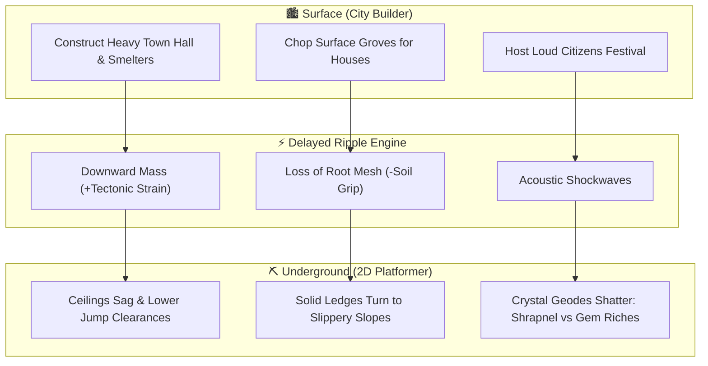

# 🏛️ Game Design Document (GDD): "OVERBURDEN"
### *Working Title:* Overburden: Tales from the Under-Town
**Genre:** Hybrid City-Builder & 2D Precision Miner-Platformer  
**Theme:** *Unexpected Consequences*  
**Tone:** Whimsical Irony meets Thought-Provoking Ecology (*ActRaiser* meets *Terraria* & *The Wandering Village*)  
**Target Directory:** `/home/meoclavezz/Projects/SJCET-Game`

---

## 🎯 High Concept
You play as the Mayor-Miner of a fledgling settlement perched atop a honeycomb of mysterious ancient caverns. To grow your town on the surface, you must personally delve into the underground platformer levels to extract ore, timber roots, and ancient power crystals. 

However, **the surface and the underground are physically entangled**: every building, road, factory, and festival you orchestrate above mechanically warps the physics, layout, hazards, and ecology of the platforming levels below.

---

## ⚖️ The 3 Core Pillars of Unexpected Consequences



### 1. The Resource Balancing Act (Visible Wealth vs. Invisible Stress)
*   **The Surface Interface displays visible metrics:** Population, Gold, Citizen Morale, and Building Capacity.
*   **The Underground hiddenly tracks geological strain:** 
    *   **Tectonic Load (Weight):** Cumulative weight of stone/iron structures on the surface.
    *   **Soil Cohesion (Roots):** Tree root density anchoring underground ceilings and platforms.
    *   **Subterranean Toxicity (Runoff):** Smelter soot, sewage, and chemical sludge density.
*   **The Sudden Crisis Trigger:** When Tectonic Load exceeds structural thresholds (25%, 50%, 75%, 100%), the underground cavern shifts in real-time. What was a breezy platformer in Level 1 becomes an obstacle-ridden hazard course with crushing ceilings, acid ponds, and unstable footholds.

### 2. The Delayed Ripple Effect (Actions Today Shape Tomorrow's Physics)
Instead of immediate punishments, choices trigger mechanical consequences across cycles:

| Surface Action (Day Phase) | Immediate Surface Benefit | Delayed Cavern Ripple (Night Platforming) | Mechanical Adaptation Required |
| :--- | :--- | :--- | :--- |
| **Heavy Stone Town Hall** | +50 Population Cap, +Housing | Cavern ceiling sags downward by 2 tiles; stalactites form | Jump height clearance restricted; high jumps hit spikes |
| **Clear-cut Surface Forest** | +300 Wood for rapid expansion | Tree roots decay underground; soil liquefies into mud | Solid rock platforms become slippery slides with high inertia |
| **Smelting Foundry** | Unlocks Iron tools & 2x Ore Value | Industrial smog vents downward into caverns | Hot updrafts enable glider flight, but toxic fog limits air time |
| **Aqueduct & Public Baths** | +Happiness, stops town fires | Drains the subterranean water table | Water pools dry up into lethal drop pits, exposing hidden rails |
| **Town Jubilees / Festivals** | +100% Tax Gold for 1 cycle | Loud brass music causes tremors underground | Cave-in seals old shortcuts, but cracks open secret gem caches |
| **Automated Drone Depot** | Passive resource collection above | Errant drones fall into caves and short-circuit | Drones become erratic, flying laser-trap obstacles in caves |

### 3. The Perverse Incentive (The Optimization Trap)
*   **The Explicit Objective:** *"Erect the Sky-Spire Monument before the Autumn Frost to win the game."*
*   **The Trap:** The most efficient surface strategy is to build 4 Heavy Smelters, strip-mine the hills, and work citizens non-stop to mass-produce Iron Blocks.
*   **The Perverse Result:** This greedy strategy raises Underground Toxicity and Tectonic Load to 100%. The final platforming descent to retrieve the essential *Aether Core* becomes near-impossible: the floor is pure acid, falling boulders drop like a bullet hell, and all stable platforms have collapsed.
*   **The True Master Strategy:** **Symbiotic Architecture.** The player must deliberately slow surface growth to plant "Ironwood Roots" (which reinforce underground ceilings), construct "Wetland Filter Gardens" (which purify cavern runoff into fresh health springs), and build "Acoustic Dampener Plazas".

---

## 🔄 Dual Core Gameplay Loop

```
┌────────────────────────────────────────────────────────────────────────┐
│                        CYCLE 1: DAY PHASE (SURFACE)                    │
│   • Top-down or Side-view City Grid (Town Planning & Citizen Needs)    │
│   • Allocate mined resources (Wood, Stone, Ore, Lumens)                │
│   • Choose buildings & zoning (Trade-offs: Production vs Strains)      │
└────────────────────────────────────┬───────────────────────────────────┘
                                     │ Elevate / Plunge
                                     ▼
┌────────────────────────────────────────────────────────────────────────┐
│                      CYCLE 2: EXPEDITION (UNDERGROUND)                 │
│   • 2D Platformer (Jump, Dash, Pickaxe Mining, Wall-Slide)            │
│   • Environmental obstacles dynamically altered by Surface state       │
│   • Collect minerals & blueprint artifacts before Oxygen / Time expires│
│   • Return to the central mine elevator to bank loot                  │
└────────────────────────────────────────────────────────────────────────┘
```

---

## 🎨 Art Style & Asset Integration (From `GAME_ASSETS.md`)

To capture the **thought-provoking yet whimsical** tone:
1. **Surface Town Art:**
   - *Option A (Pixel Art):* LimeZu's *Modern Interiors/Exteriors* + Kenney's *Tiny Town / Roguelike* tilesets.
   - *Option B (Stylized 2D Vector):* Kenney *Abstract Platformer / UI Pack*.
2. **Underground Cavern Art:**
   - 0x72's *DungeonTileset II* or Cainos' *Pixel Art Top Down / Platformer*.
   - Dynamic fluid tilesets (clear water vs bubbling green industrial sludge).
   - Debris particles and cracking platform animations.
3. **Audio & Ambience:**
   - *Surface:* Upbeat, whimsical acoustic loops (PlayOnLoop / Bensound).
   - *Caverns:* Reverb-heavy, ambient chime echoes (Incompetech / Freesound).
   - *Dynamic SFX:* Procedural 8-bit sound effects synthesized via `jsfxr`.

---

## 🛠️ Recommended Engine & Tech Stack

| Option | Engine / Framework | Pros | Best Fit For |
| :--- | :--- | :--- | :--- |
| **Option 1 (Recommended)** | **Web (TypeScript + Phaser 3 / Vite)** | • **Instant presentation:** Runs in any browser with zero local engine installation.<br>• Built-in arcade physics, tilemaps, particle emitters, camera transitions.<br>• Extremely portable for sharing, game jams, and portfolio demos. | Rapid iteration, instant visual showcase, zero setup hurdles. |
| **Option 2** | **Godot 4 (GDScript)** | • Dedicated 2D node-based engine with TileMapLayer and physics.<br>• Native UI controls and smooth animation tree.<br>• Requires installing `godot` package on system. | Full-fledged desktop release with deep lighting shaders and gamepad support. |
| **Option 3** | **Python (Pygame-CE / Arcade)** | • Runs natively on Arch Linux with existing Python 3.14.<br>• Full programmatic control. | Quick algorithmic prototypes, but slower rendering for complex particle and UI systems. |

---

## 📋 Milestone & Development Roadmap

### Phase 1: Core Dual Prototype
- [ ] Implement dual-state switch: Surface Town View <---> Subterranean Platformer View.
- [ ] 2D Player controller: Responsive jump, gravity, wall cling, and pickaxe strike.
- [ ] Basic mining node interaction: hit ore -> gain resource inventory.

### Phase 2: The Ripple Physics Engine
- [ ] Connect Surface building placement to Cavern parameters (Weight -> Ceiling Sag, Deforestation -> Slippery Floor).
- [ ] Dynamic hazard transformation (Water pool -> Sludge/Acid pool based on surface factories).
- [ ] Elevators and Bank Depot: Returning with loot upgrades town.

### Phase 3: Strategy & Balance Layer
- [ ] Surface building catalog (Town Hall, Lumber Mill, Foundry, Eco-Nursery, Water Well).
- [ ] Perverse Incentive Goal condition (Build the Monument within X cycles).
- [ ] Game Over / Win conditions: Catastrophic Cave Collapse vs. Harmonic Bio-Metropolis.

### Phase 4: Polish, UI & Audio Presentation
- [ ] Visual juice: screen shake on tremors, falling dust particles, sound effects (jump, pickaxe, collapse).
- [ ] Clean HUD showing surface stats + subterranean strain gauges.
- [ ] Full credits integration referencing [`CREDITS.md`](file:///home/meoclavezz/Projects/SJCET-Game/CREDITS.md).
