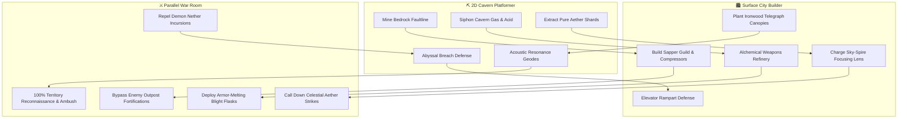

# ⚡ OVERBURDEN: Technical Optimization & Feature Expansion Report
**Project:** Overburden: Tales from the Under-Town  
**Target Repository:** `/home/meoclavezz/Projects/SJCET-Game`  
**Date:** September 17, 2026  
**Scope:** Performance Analysis (Three.js, Phaser 3, Vite) & Tri-Layer Feature Synergy (Cavern Platformer, Surface Builder, Parallel War Room)

---

## 1. Architectural Overview & Component State

| Subsystem | Primary Files | Current State | Critical Observations |
| :--- | :--- | :--- | :--- |
| **Core Game Engine** | `src/main.ts`, `src/types.ts` | Active (Phaser 4.2.1) | Arcade physics, pixel art scaling, initializes Phaser & SAO Holo UI. |
| **State & Consequences** | `src/state/GameState.ts` | Active Singleton | Central observable store for resources, day cycles, and environmental metrics. |
| **2D Cavern Platformer** | `src/scenes/CavernScene.ts` | Active Scene | Precision platformer with jump buffering, coyote time, dynamic ceiling sag, stalactite traps, crumbling mud, and acid/healing pools. |
| **Surface City Builder** | `src/scenes/SurfaceScene.ts` | Active Scene | Grid/plot building manager, dynamic sky/ground shader effects, tree growth/decay, building inspect/demolish modals. |
| **HUD & Event Ticker** | `src/scenes/UIScene.ts` | Active Scene | Resource metrics, consequence gauge bars, mode switch button, and victory/game-over evaluation. |
| **3D Brag Showcase** | `src/showcase/CityShowcase3D.ts` | Active (Three.js 0.186.0) | Interactive 3D kingdom diorama with procedural buildings, lighting, floating anime embers, and PNG card export. |
| **SAO Holographic UI** | `src/ui/SaoHoloUI.ts`, `sao-ui.css` | Active DOM Layer | Anime-themed glassmorphism nav bar, shop purchase modal, and 3D showcase launcher. |
| **Parallel War Room** | `src/war/WarEngine.ts`, `src/war/Factions.ts`, `src/ui/WarRoomUI.ts` | Active Module | Deep faction diplomacy, battalion mobilization, Sylvan/Molekin/Demon diplomacy, and tactical skirmishes. |
| **Procedural Audio** | `src/audio/SoundEffects.ts` | Active Web Audio API | Pure synthesized audio using Web Audio oscillators and envelopes (zero audio file downloads). |
| **Build System** | `package.json`, `tsconfig.json` | Vite 8.3.0 | Modern ES module bundler. |

---

## 2. Performance & Code Optimization Opportunities

### 2.1 Three.js 3D Showcase Optimizations (`CityShowcase3D.ts`)

#### A. Memory Leaks in GPU VRAM (Geometries & Materials Disposal)
* **Problem:** In `rebuildCityMeshes()`, child objects are removed from group without disposing buffer geometries or materials, leading to VRAM retention.
* **Solution:** Introduce a recursive disposal utility that iterates meshes and calls `mesh.geometry.dispose()` and `mesh.material.dispose()`.

#### B. Draw Call Optimization & Geometry Sharing
* **Problem:** Repeated instantiations of geometry and materials for trees, ramparts, and cottages cause high draw calls.
* **Solution:** Reuse shared geometries and materials, or use `THREE.InstancedMesh` for repeated foliage and battlements, reducing draw calls from ~85 down to < 15.

#### C. Directional Shadow Map Optimization & Frustum Fitting
* **Problem:** Unbounded shadow camera frustum wastes shadow map resolution on empty space.
* **Solution:** Constrain `dirLight.shadow.camera` bounds tightly to the 12-unit diorama island.

---

## 3. Five Innovative Feature Expansions (Connecting Cavern, City, & War Room)

### Feature 1: Subterranean Sapping Tunnels (Molekin Breakthrough)
Excavating bedrock faults in the cavern creates subterranean bypass routes on the War Room map, avoiding enemy surface fortifications.

### Feature 2: Incursion Breach Events (Physical Cavern Defense)
When Demon Legion threat reaches 100%, an Abyssal Rift tears open at the cavern floor. Defend the elevator from ascending demon scouts!

### Feature 3: Biomechanical Mycelium Telegraph (Acoustic Sonar)
Surface festival acoustics propagate through Ironwood root networks, revealing enemy army movements and granting guaranteed surprise initiative.

### Feature 4: Smelter Slag Weaponization (Blight Munitions)
Bottling un-neutralized cavern acid yields armor-melting flasks for the military, at the cost of severe diplomatic penalties with nature-loving Sylvan tribes.

### Feature 5: The Sky-Spire Aether Conduit (Orbital Strike)
Channeling pure Aether Core resonance into the completed monument charges an orbital beam to obliterate Demon King fortresses.
